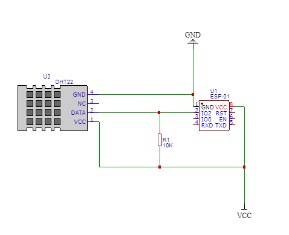
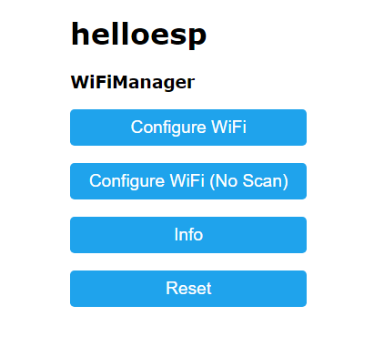
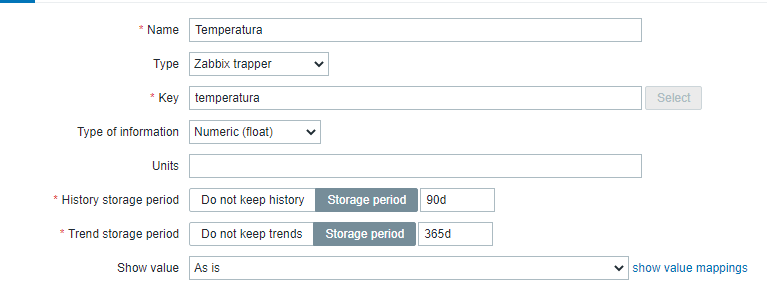

# Zabbix-ESP-Sender
Integração entre a ferramenta Zabbix e uma ESP-01 utilizada para coletar dados de temperatura e umidade. Os dados são enviados para o Zabbix via Zabbix Sender.

# Esp-01 - Zabbix - Zabbix Sender (Monitor de temperatura e umidade)

Esse é um tutorial para configuração do Zabbix Sender para monitoração de temperatura e umidade utilizando-se uma ESP-01.


# Esquemático



## Requerimentos

Para o correto funcionamento do upload, necessita-se:

 - Arduino IDE  ([Download](https://www.arduino.cc/en/main/software));
 - As bibliotecas:
 WifiManager.h ([Download](https://github.com/tzapu/WiFiManager));
 ESP8266ZabbixSender.h ([Download](https://github.com/zaphodus/ESP8266ZabbixSender));
 DNSServer.h ([Download](https://github.com/esp8266/Arduino/tree/master/libraries/DNSServer));
 ESP8266WebServer.h ([Download](https://github.com/esp8266/Arduino/blob/master/libraries/ESP8266WebServer/src/ESP8266WebServer.h)).
 DHT.h (Baixar na ide)
 
 - Módulo ESP-01;
 - Sensor DHT22;
 - Um resistor de 10kohms;
 - Adaptador Serial para ESP-01;
 - Uma chave.


## Como instalar as bibliotecas

Após fazer Download das bibliotecas em formato .ZIP, copie as pastas para o diretório "arduino-1.8.12\libraries".

	> O nome do diretório vai depender da versão da ide.

## Fazer Upload do Código para a placa

Na ide, vá em Arquivo/Preferências e no campo “URLs Adicionais de Gerenciamento de Placas” inserir o [link do pacote ESP8266](http://arduino.esp8266.com/stable/package_esp8266com_index.json), depois clique em OK. 

Após isso, clique em Ferramentas/Placa:/Gerenciador de Placas. Procure pelo pacote do ESP8266 e instale.
Para fazer a comunicação com o módulo precisa-se de um conversor USB-Serial. Com o auxílio da chave, conecte o pin0 ao GND.
Clique em "Upload"

Para verificar o funcionamento da conexão, bem como do sensor, clique em:
"Tools" > "Serial Monitor"
Escolha um baud de 115200.

## WifiManager.h

Para conectar ao Wifi, clique na rede "helloesp". Após isso, digite o endereço "http://192.168.4.1/" no navegador. 
Ele irá direcionar para a seguinte tela:


Clique em "Configure Wifi" 
Clique no ssid e insira a senha.


## Configuração - Zabbix

Para configurar o host no zabbix, adicione o IP e o host no código como mostrado no exemplo:
```
#define SERVERADDR 192, 168, 25, 12 // Zabbix server Address
#define ZABBIXPORT 10051      // Zabbix erver Port
#define ZABBIXAGHOST "ESP01"  // Zabbix item's host name
```

Após isso, acesse o Zabbix. Na aba "Configuration", clique em "Hosts" e "Create new Host";

- Adicione o mesmo Host name.
- Escolha o grupo 
- Adicione a posta em "Interfaces".

Então, clique em "Items" e "Create item";
Adicione a configuração conforme a imagem:



Faça o mesmo para a Umidade.

E Voilà, você poderá visualizar os dados em Latest Data.
